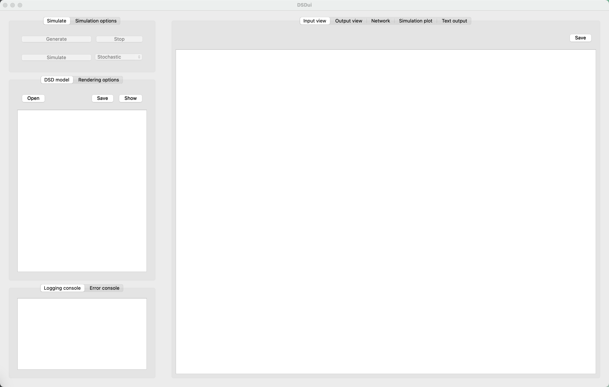
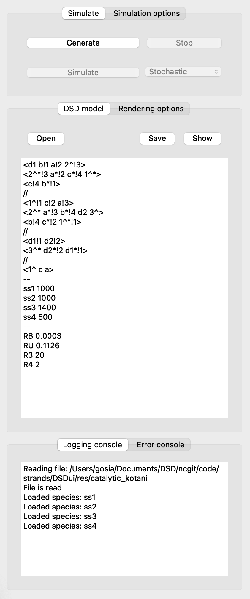
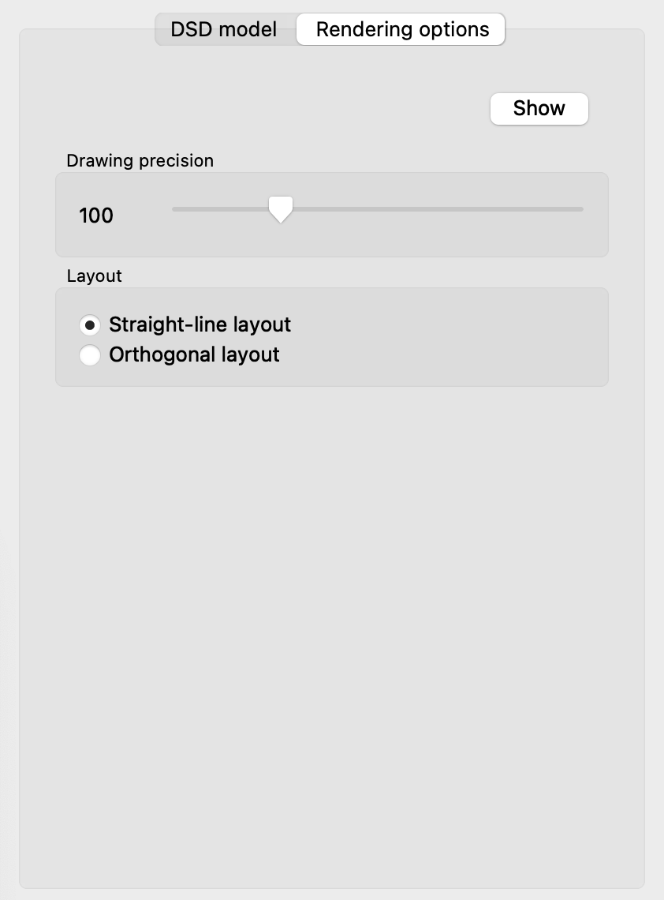
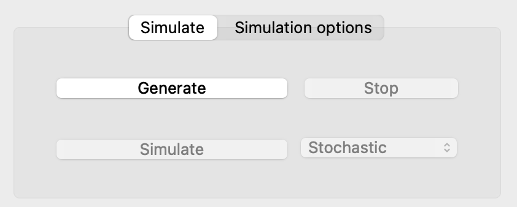
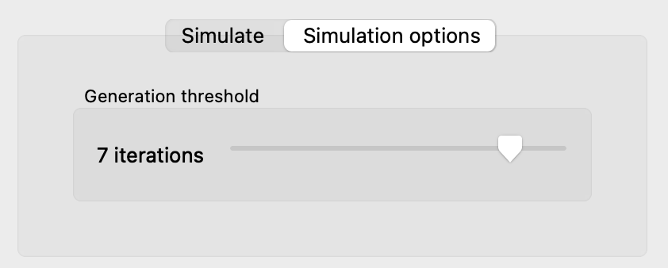
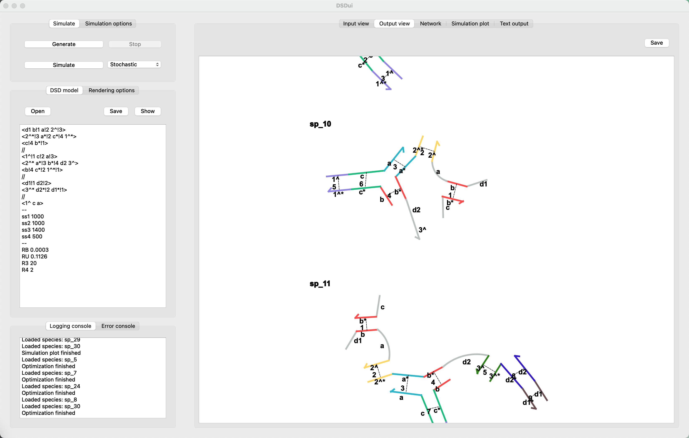
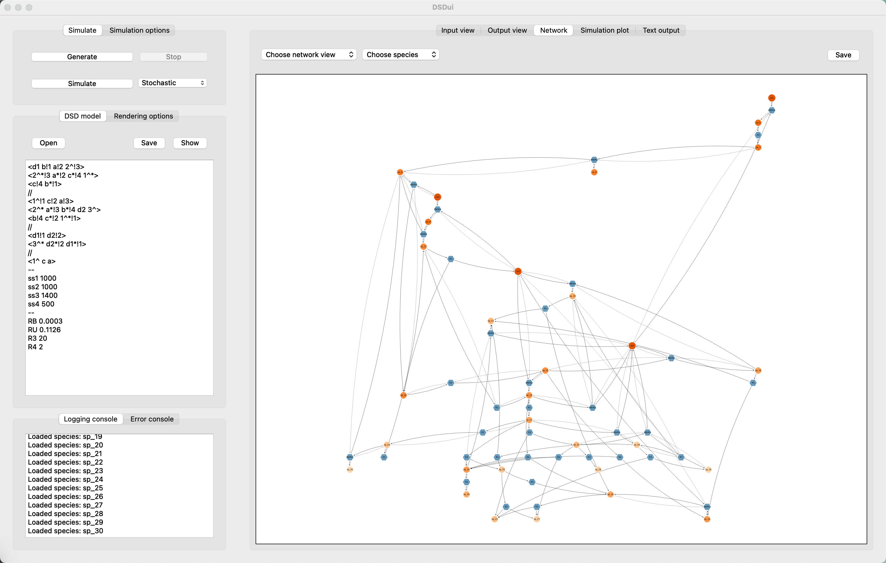
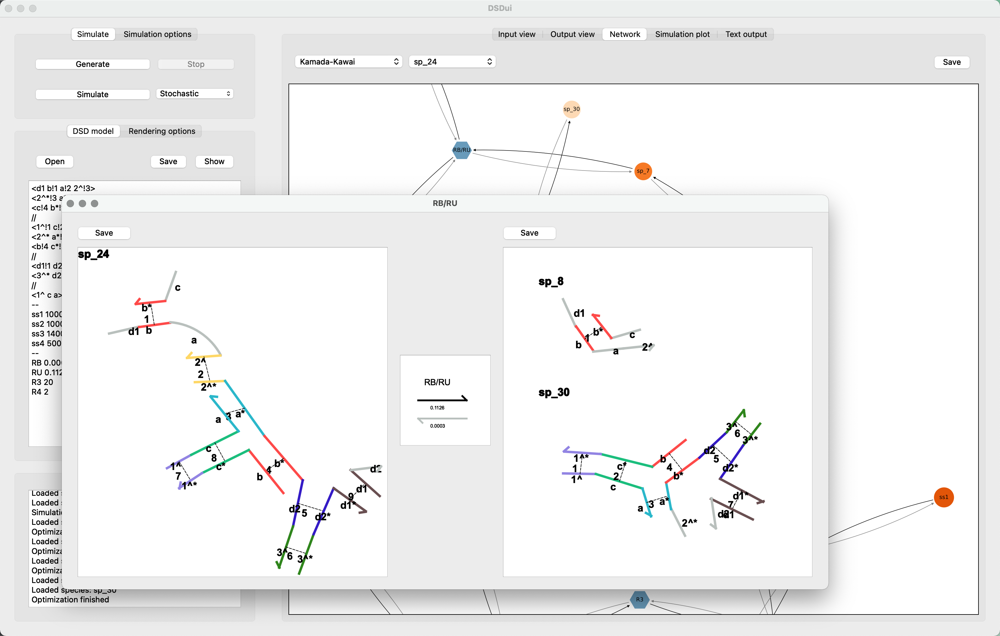
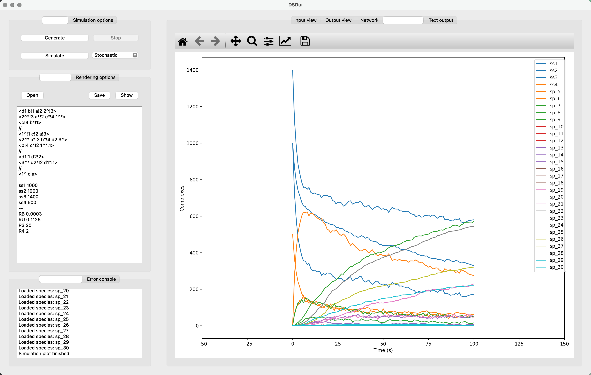
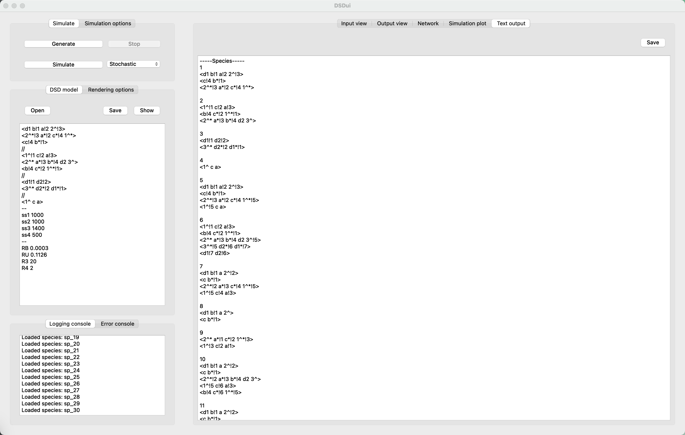

Tutorial
==========

Prerequisities
----------------

1. To create the Anaconda environment:
::

    conda env create -f environment.yml
    conda activate dsdui
    dot -c

2. To install OGDF library follow the `OGDF installation guide <https://github.com/ogdf/ogdf/blob/master/doc/build.md>`__ or instructions below:

Requirements
~~~~~~~~~~~~~

- CMake 3.1+
- C++11 compliant compiler

    - gcc 4.9.2+
    - clang 3.5+
    - Microsoft Visual C++ 2015+

- GNU Make (in most cases)

Build
~~~~~~

Download the latest release of `OGDF library <https://github.com/ogdf/ogdf/>`__, change the name of the folder to `ogdf` and put the folder in `src`.

For Unix systems follow the commands below.

::

    ./build.sh

or

::

    cd ogdf
    cmake --build ./cmake-build-release --target OGDF -- -j 3
    rm -R ./cmake-build-release/lib && echo "Removed existing lib directory"
    mkdir ./cmake-build-release/lib && cd ./cmake-build-release/lib && echo "Created new lib directory"
    ar -x ../libOGDF.a
    ar -x ../libCOIN.a && echo "Unpacked the static libraries libCOIN.a and libOGDF.a"
    g++ -shared *.o -o libOGDF.so && echo "Created a shared library libOGDF.so"

Alternatively, you can use an IDE of your choice for building the project in
the Release mode. Then follow the commands above from `mkdir ./lib && cd ./lib && echo "Created new lib directory"` line or copy your compiled library files (.so in the case of Unix systems, .dll and .lib in Windows) to the folder `./ogdf/cmake-build-release/lib` and synch the `include` directories in the `./ogdf/cmake-build-release` folder and `./ogdf` folder.

Run program
---------------
If you followed the build guide for OGDF, run the program without arguments.
::

    python main.py

In the case your compiled library files are stored elsewhere, run the program with the path that points to your compiled library files.
::

    python main.py PATH_TO_COMPILED_LIBRARY_FILES

Usage
------------
Upon running the program a standalone application appears:

    DSDPy user interface

Input
~~~~~~
1. **DSD model** tab accepts the text input in the form described in `DSDPy manual <https://dsdpy.readthedocs.io/en/latest/tutorial.html#creating-your-own-input>`__.

    DSD model tab

2. **Rendering options** allows to choose the rendering speed and precision and used layout.

- **Drawing precision** correspond to the iteration number that the simulated annealing algorithm starts with. Greater values yield better rendering results but the rendering process takes more time

- **Straight-line layout** draws a planar planar graph with straight lines. The current implementation of the algorithm contains a bug in the augmentation module and therefore some species may contain unexpected crossings. Moreover, user might want to render a species that is not planar. In that case, try **Orthogonal layout**, which draws a any graph with straight lines (with the note that the underlying graph is assumed to have edges bending 90 degrees, therefore crossings may appear in a straight-line interpretation)

    Rendering options tab

Simulation
~~~~~~~~~~~

    Simulation buttons group

    Simulation options tab

1. **Generate** button starts the reaction network generation
2. **Simulate** button starts the simulation - choose the mode from the combo box (stochastic / deterministic)
3. **Simulation options** tab provides settings for threshold of iterations in reaction network generation

Output
~~~~~~~

1. **Input view** tab displays the parsed input species to the DSDPy. **Output view** tab displays the parsed output species from the DSDPy.

- save the views as a PNG with save button

    Rendered DSD species

2. **Network** tab displays the chemical reaction network

- choose the network layout from the options in the combo box
- zoom and pan to navigate through the network

    Network tab after clicking Generate button

- click on the species' name to view the species
- click on the reaction name to view the reactants, products and reaction rate of the reaction

    Reaction window after clicking on a reaction node

3. **Simulation plot** tab displays BNG simulation plot

    Simulation tab after clicking Simulate button

4. **Text output** tab displays the text output from the DSDPy

    Text output tab after clicking Generate button