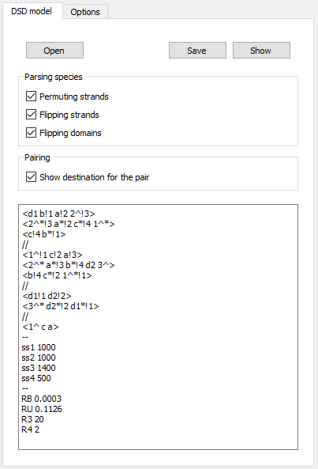
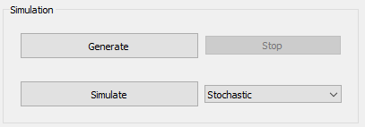

Tutorial
==========

Prerequisities
----------------

* To create the Anaconda environment:

::

    conda env create -f environment.yml
    (DSDrender) > dot -c

* Manual installation:

::

    conda install -c alubbock pysb
    conda install -c conda-forge networkx
    conda install -c conda-forge matplotlib
    conda install -c anaconda pyqt
    conda install -c conda-forge bidict
    conda install -c alubbock graphviz pygraphviz

Run program
---------------
::

    python main.py

Usage
------------
Upon running the program a standalone application appears:

.. figure:: tutorial.png
    :align: center

    DSDPy user interface

Input
~~~~~~
1. **DSD model** tab accepts the text input in the form described in `DSDPy manual <https://dsdpy.readthedocs.io/en/latest/tutorial.html#creating-your-own-input>`__.

- choose if the parsing algorithm should be able to: permute the strands, flip the strands, flip the domains
- choose if the dots, denoting the destination of the pair, should be displayed

    DSD model tab

2. **Options** tab provides settings for:

- threshold of iterations in reaction network generation
- rendering speed - the greater the speed, the quicker and less accurate the output rendering (default settings: exponentially increasing for simple species, linearly increasing for pseudoknots)
- render button starts the rendering of the current view

    Options tab

Simulation
~~~~~~~~~~~

    Simulation buttons group

1. **Generate** button starts the reaction network generation
2. **Simulate** button starts the simulation - choose the mode from the combo box (stochastic / deterministic)

Output
~~~~~~~

1. **Input view** tab displays the parsed input species to the DSDPy. **Output view** tab displays the parsed output species from the DSDPy.

- **Render** button starts the rendering of the current view
- choose the input and output of the render from the combo box
- save the views as a PNG with save button

.. figure:: render.png
    :align: center

    DSD species before rendering

    DSD species after rendering

2. **Network** tab displays the chemical reaction network

- choose the network layout from the options in the combo box
- zoom and pan to navigate through the network

.. figure:: network.png
    :align: center

    Network tab after clicking Generate button

- click on the species' name to view the species
- click on the reaction name to view the reactants, products and reaction rate of the reaction

    Reaction window after clicking on a reaction node

3. **Simulation plot** tab displays BNG simulation plot

    Simulation tab after clicking Simulate button

4. **Text output** tab displays the text output from the DSDPy

.. figure:: text.png
    :align: center

    Text output tab after clicking Generate button